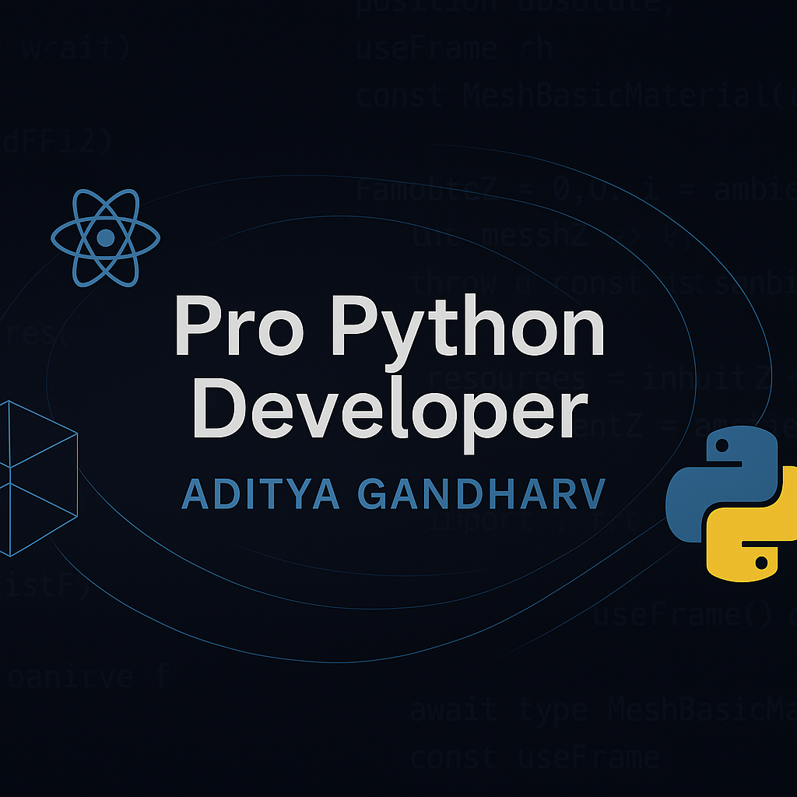

<!-- 🔥 Tagline (optional but recommended) -->
<p align="center">
  <b>🚀 Learning Python the Right Way – From Basics to File Handling!</b><br/>
  <i>Guided by Vikash Yadu Sir at Yashvi Tech</i>
</p>

<p align="center">
  
</p>
# 🐍 Python Learning Journey

This repository contains all my Python learning materials, notes, practice codes, and important resources.  
I'm learning **Python** under the mentorship of **Vikash Yadu Sir** at **Yashvi Tech**.

## 👨‍🏫 Instructor
**Vikash Yadu Sir**  
Mentor at **Yashvi Tech**  
A highly skilled and supportive guide helping us master Python from the basics to the advanced.

---

## ✅ Topics Covered (Completed)

All the following topics have been covered with examples, practice questions, and notes:

- ✅ Python Introduction  
- ✅ Data Types  
- ✅ If-Else Conditions  
- ✅ Loops (For, While, Nested Loops)  
- ✅ Functions (User-defined & In-built)  
- ✅ Pattern Printing  
- ✅ Object-Oriented Programming (OOPs)  
- ✅ Top Python Coding Questions  
- ✅ File Handling  
- ✅ Exception Handling  
- ✅ Lambda, Map, Filter, Reduce  
- ✅ Python Features (Decorators, Iterators, Generators)  
- ✅ Modules & Packages  
- ✅ Working with JSON, CSV, and External Files  

> 📌 *All content is organized folder-wise and updated regularly.*

---

## 🗂️ Repository Structure

📁 FirstDay/ → Basics of Python
📁 Day 2/Data Types/ → Data Types Practice
📁 Function/ → Functions and Patterns
📁 Inbuilt Function/ → Built-in Functions
📁 Nested Loop/ → Loops and Pattern Exercises
📁 OOPs/ → Classes, Objects, Inheritance, etc.
📁 Python Top 50 Question/ → Common Coding Interview Questions
📁 ifelse Question/ → Condition-based Logic
📄 Python Notes.pdf → Summary Notes
📄 Top_50_Python_Coding_Questions.pdf → Practice Bank
📄 Basic Of Python.png / Oops.png → Visual Notes

yaml
Copy
Edit

---

## 🎯 How I Use This Repository

- 👨‍💻 Daily coding practice with real-world examples  
- 📚 Maintain notes for quick revision  
- 🧠 Strengthen logic for interviews  
- 🚀 Build solid foundation for Django, Flask, etc.

---

## 📥 Clone This Repository

You can clone this repo using:

```bash
git clone https://github.com/aadigandharw/Python.git
Explore folders based on topics and start practicing!

🙏 Credits
Guided by:
Vikash Yadu Sir
Yashvi Tech

📘 “Practice consistently. Python mastery is a journey of dedication and curiosity.”
